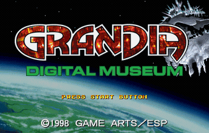
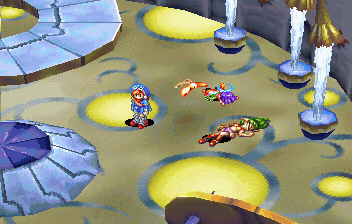
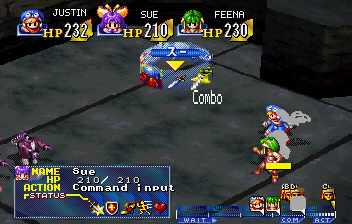
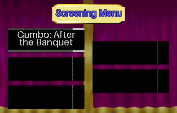
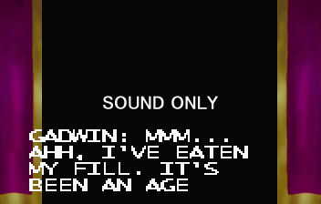
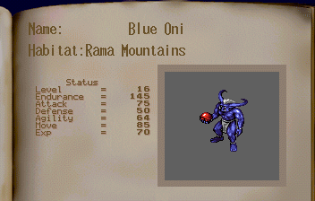
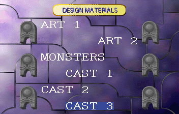
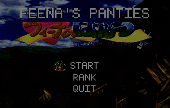

# Grandia: Digital Museum — English Translation Patch

An English fan translation of *Grandia: Digital Museum*, the Japan-only Sega Saturn
companion to *Grandia*.



> **Release status:** **alpha-0.2.0** is the version I have been playing on and off for the past
> month. I will continue to iterate on it as I have time. Please report anything that looks
> wrong—especially with a screenshot and a savestate.

## Welcome back to Grandia

*Digital Museum* reunites Justin, Sue, Feena, and the rest of the cast in a new adventure set
inside the Alent Museum. It includes original story scenes, four playable dungeons, a monster
encyclopedia, character and design galleries, voiced theater dramas, and eight minigames.

The patch translates the story and dialogue, field and battle UI, items, skills, enemies,
museum exhibits, gallery menus, monster data, theater menus and timed captions, minigame text,
and the many fixed-image labels scattered throughout the game. Terminology follows the English
Sega Saturn translation of the original *Grandia* wherever possible.

## See it in action

### A new museum adventure

A New Game now plays in English from the opening scene onward.



The main scenario, optional conversations, character voices in the Expressions gallery, and
the museum's incidental dialogue have all been translated.

### Battles

Battle commands, character and enemy names, attack messages, skills, magic, item descriptions,
tactics, defense options, and post-battle results use the established English *Grandia* wording
and visual style.



### The theater

The theater selection screen and all five audio dramas are accessible in English. The original
Japanese performances are preserved, with newly injected timed English captions.





### Museum collections

The Monster Guide includes English names, habitats, and stats. The Design Materials and
Expressions galleries have translated navigation, labels, prompts, and character quips.





### All eight minigames

Every arcade game has been unlocked and validated in-game. Where the original title art is an
important part of the design, it is preserved with an English subtitle; menus, prompts, and
gameplay text are translated.

<table>
  <tr>
    <td><strong>Deck-Swab Remix</strong><br></td>
    <td><strong>Leen Hates Frogs!</strong><br></td>
  </tr>
  <tr>
    <td><strong>Sue! Gantz's Bride Plot</strong><br></td>
    <td><strong>Feena's Panties</strong><br></td>
  </tr>
  <tr>
    <td><strong>Bonk-a-Tray!</strong><br></td>
    <td><strong>Hot-Blooded Showdown!</strong><br></td>
  </tr>
  <tr>
    <td><strong>Big-Eater: Grandia Cup</strong><br></td>
    <td><strong>Baal's Challenge</strong><br></td>
  </tr>
</table>

## What you need

This repository contains only a patch. **No game disc image or copyrighted game data is
included.** You must supply your own dump of:

| | Required source |
| --- | --- |
| Redump title | `Grandia - Digital Museum (Japan) (Rev A) (10M)` |
| Track to patch | Track 1, `MODE1/2352` |
| Track 1 size | `455,394,240` bytes |
| Track 1 MD5 | `59b19105615ca37886e1e0542ff2967e` |
| Track 2 MD5 | `03b644cc286bc57840e99cf5904cb2f8` |

If Track 1 does not match that hash, the patch will not apply.

## Included patch formats

| File | Use |
| --- | --- |
| `Grandia-DM-EN-alpha-0.2.0.ssp` | Apply with Sega Saturn Patcher to the original `.cue`; enable **Separate Track Files**. |
| `Grandia-DM-EN-alpha-0.2.0.Track1.xdelta3` | Apply to Track 1 with the included scripts or another xdelta3 frontend. |

## Applying the patch

### Sega Saturn Patcher (recommended)

1. Open the `.cue` from the unmodified Redump dump in Sega Saturn Patcher.
2. Select `Grandia-DM-EN-alpha-0.2.0.ssp` as the patch.
3. Enable **Separate Track Files**, choose an output location, and patch.
4. Load the generated `.cue` file, rather than an individual `.bin`, in your emulator, ODE, or burning software.

The SSP and xdelta patches produce the same alpha-0.2.0 translation data. The SSP is intended for
the Sega Saturn Patcher workflow; use the xdelta method below if you prefer a command-line or
cross-platform workflow.

### macOS and Linux

Install `xdelta3`, then run the included helper with the two tracks from your unmodified dump:

```bash
./apply-patch.sh \
  "Grandia - Digital Museum (Japan) (Rev A) (10M) (Track 1).bin" \
  "Grandia - Digital Museum (Japan) (Rev A) (10M) (Track 2).bin"
```

Load `patched/Grandia-DM-EN.cue` in your emulator or optical-drive emulator.

### Manual xdelta3 method

The large source window flag is required:

```bash
xdelta3 -d -B 800000000 \
  -s "Grandia - Digital Museum (Japan) (Rev A) (10M) (Track 1).bin" \
  Grandia-DM-EN-alpha-0.2.0.Track1.xdelta3 \
  Track1.bin
```

The alpha-0.2.0 patched Track 1 should be `492,417,072` bytes with MD5
`933c380f4d31aff22a191ca3cadd6532`. Keep the original Track 2 unchanged and use the cue sheet
created by `apply-patch.sh`.

### Windows

Run `apply-patch.ps1` from PowerShell, or apply
`Grandia-DM-EN-alpha-0.2.0.Track1.xdelta3` to the matching Track 1 with an xdelta frontend such as Delta
Patcher. Copy the original Track 2 alongside the patched data track and use the included cue sheet.
Always launch the `.cue`, not an individual `.bin`.

## Compatibility notes

- The patched data track is larger than the original because English text and several translated
  assets were safely relocated. It still fits comfortably on a standard CD-R.
- Use the generated cue sheet. Reusing the original cue with the larger patched Track 1 gives
  Track 2 the wrong start time.
- Cold-boot when changing patch versions. Savestates can retain text, graphics, and disc-file
  pointers from the build on which they were created.
- Modified sectors have regenerated Mode 1 EDC/ECC data for real-hardware and strict-emulator
  compatibility.

The patch is developed and tested primarily with [Ymir](https://github.com/StrikerX3/Ymir).
Reports from Mednafen, SSF, MiSTer/SuperStation, ODEs, and original hardware are welcome.

## Reporting a problem

Before reporting, check the repository's open issues. Then **[open an issue](../../issues/new/choose)**
with as much of the following as possible:

- the patch version (`alpha-0.2.0`, for example);
- emulator or hardware setup;
- a screenshot;
- steps to reproduce; and
- a savestate immediately before the problem, zipped so GitHub will accept it.

A nearby savestate is often the difference between merely seeing a bug and being able to fix it.

## How it was made

This is an AI-assisted fan-translation and reverse-engineering project, directed and reviewed by
a human maintainer. The process combined:

- text and asset extraction based on the existing Saturn *Grandia* research;
- a project dictionary grounded in the established English localization;
- scene-by-scene translation, review, and consistency passes;
- custom encoders and relocation tools for Saturn text, sprites, menus, and compressed graphics;
- timed caption authoring for the Japanese-voiced theater dramas; and
- a headless Ymir validation harness that can load registered savestates, drive the game, capture
  frames, and regression-test fixes.

## Legal

This is an unofficial fan project and is not affiliated with or endorsed by GAME ARTS, ESP,
SEGA, or any other rights holder. It contains no game disc image and is distributed only as a
patch to use with a copy you own.
