# Grandia: Digital Museum — English Translation (Alpha Release)

Hi everyone,

I'm excited to share an AI-assisted fan translation of *Grandia: Digital Museum* for Sega Saturn. I recognize that this may be controversial and if a more polished community effort comes together I will be happy to reference that as the cannonical approach.

I'm a huge fan of the Grandia series but have been unable to fully enjoy my Digital Museum disc due to not being able to read Japanese. This project has enabled me to enjoy the game on my SuperStation One as well as emulators. I hope others can enjoy it too!

**A word of caution (here be dragons):** This is very much an alpha release. It's imperfect, and you should expect crashes, graphical glitches, and untranslated text. Some of the UI and text styles are still fairly janky, but polish and further fixes are in flight. See [KNOWN-ISSUES.md](KNOWN-ISSUES.md) for the current list of known limitations.

However, the core of the museum, dungeons, and menus are explorable. It's been a blast for me to experience it this way, and I wanted to give other fans a chance to do the same, even in this incomplete state. Any issue reports from those playing the game would be appreciated.

---

### Project Showcase
***A quick note on the GIFs below:** Many of these were captured during various stages of development using AI assistance (largely by Claude Opus 4.8, with some Fable usage). The final patch has since tightened the release up and translated many of the Japanese text elements you might still see in these animations*

Here is a look at the current state of the project across various parts of the game.

#### Dialogue & Story
Much of the script and in-game text is now translated, allowing you to follow the story and character interactions.

*Expressions viewer:*
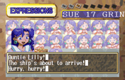

#### The Museum Galleries
The center of the game is the museum itself, with multiple galleries to explore.

**Theater**
The theater dramas are Japanese-voice-only. We were able to create English subtitles by running the original Japanese audio through an Automatic Speech Recognition (ASR) pipeline to generate a transcript, which was then translated and injected back into the game as timed captions.

*Live subtitle injection:*
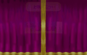

*Translated theater menus:*
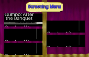

**Monster Guide**
The monster encyclopedia is now readable in English, with translated names and detailed descriptions. (The stats are still in Japanese, but I will get to that eventually!)

*Navigating the monster list:*
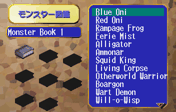

**Art & Design Gallery**
The extensive galleries of concept art and character designs are now navigable with translated category menus.

*Scrolling through the main gallery categories:*
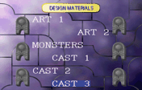

#### Casino & Minigames
The various minigames in the game room are also being translated. While all 8 minigame titles are translated, I haven't been able to validate all of them in-game yet. If anyone has a save state with all the minigames unlocked, it would be a huge help, but I'll get there eventually!

*Big-Eater Grandia Cup title screen:*
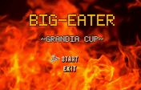

*Deck-Swab Remix title screen:*
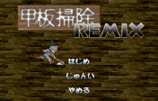

#### Battle System
Battles are largely functional with translated commands, skills, and enemy names.

*Basic battle commands:*
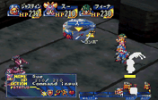

*In-battle skill selection menu:*
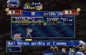

#### General Menus & UI
*Item & Equipment Menu:*
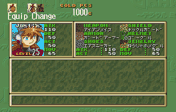

*Save Game Browser:*

*The Moves/Magic growth screen (showing a known visual bug with text cutoff—work in progress!):*
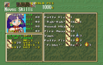

---
### High-Level Technical Approach

This project was largely accomplished using a mix of AI assistance and custom tooling. Here is the basic workflow:

1.  **Text Extraction:** All Japanese text was extracted from the game files, leveriging the fantastic tools and references published by TrekkiesUnite118 in the Saturn modding community.
2.  **Dictionary Building:** A master dictionary of terms was created from previous *Grandia 1* translation efforts and online docs to ensure character names, items, and places remained consistent with series canon. This list was kept up to date as we added to it for a consistent experience.
3.  **AI-Assisted Translation:** AI models (primarily Opus 4.8 and some Fable) were used to translate the game scene-by-scene. This was a collaborative process where I reviewed the AI's output on a webpage and provided corrections to guide the tone and style.
4.  **Text Re-Injection and Assembly:** The process of getting new, often longer, English text back into the game was refined for the intro scene and then expanded across all scenes. This involved modifying the game to use a smaller font and dynamically expanding text boxes to fit the dialogue without resorting to truncations.
5.  **Headless Validation Harness:** A "headless" automated testing system was built using the YMIR emulator. This enabled me to solve graphical or gameplay stability issues without going crazy manually validating every step the AI took along the way. It looked like:
    *   Providing an AI agent with a save state and description of a bug (e.g., "this menu is untranslated," often with screenshots).
    *   The agent would then "play" the game in the background, iterating through potential code changes until it found a valid fix.
    *   Finally, the agent would report back with a summary of the resolution and a proof-of-success GIF. All the GIFs in this post were generated this way!

---

### How to Help

This project is a labor of love, and community feedback is invaluable. If you encounter bugs, translation issues, or graphical glitches, please report them.

**[→ Open a new issue](../../issues/new/choose)** — it opens a short form that walks you through what helps most (a screenshot and a zipped savestate from right at the failing spot). See [KNOWN-ISSUES.md](KNOWN-ISSUES.md) first to check whether it's already tracked.

Happy Gaming!
